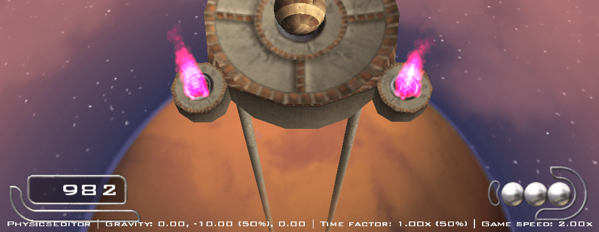

# Ballance Physics Editor

## Introduction

Ballance Physics Editor is a simple mod for modifying various settings related to physics in the game of Ballance. Requires [Ballance Mod Loader](https://github.com/Gamepiaynmo/BallanceModLoader).

## Usage

### Supported Settings

- Gravity. Default: (0, -20, 0).
- Ingame physics time factor. Default: 2 (*not 1 !!!*).
- Global game speed. Default: 1 (obviously).

### How to turn off this stupid mod? It does not seem to possess any switches.

Just set everything in settings to their default values. You can also directly remove the mod itself.
